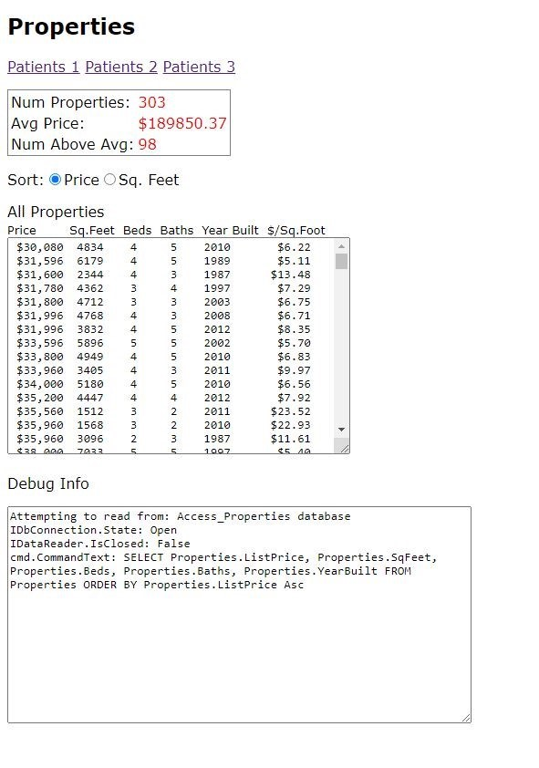
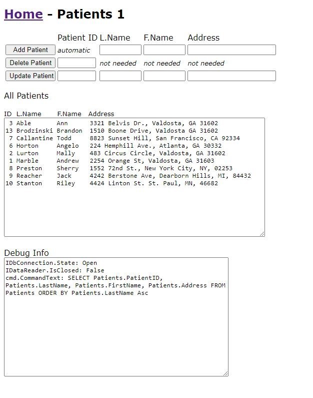
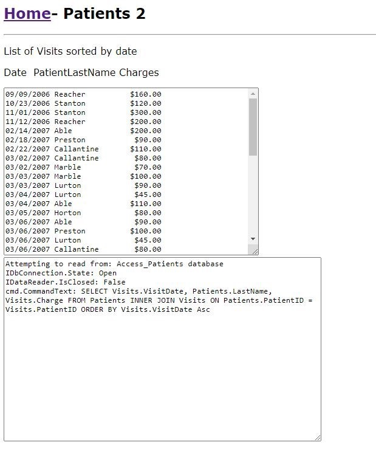
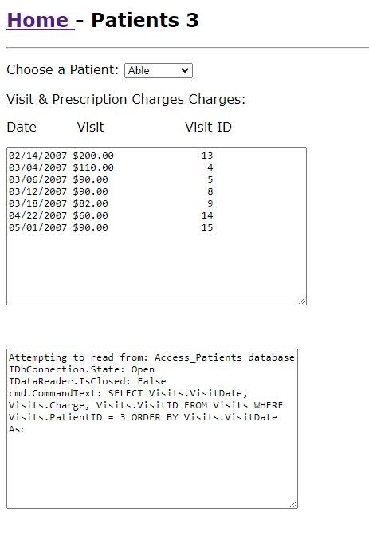

# Properties Patients Database

Properties and Patients database utilized to do various functions.

## Properties:
  
  
Calcuates stats of properties and allows list of homes for sale to be sorted by price or square feet.

## Patients:

  
Patients are stored in a database and can be added, deleted, and updated via GUI and all patients are automatically updated. (Patients 1)    
  
Displays all visit dates, corresponding patient last names, and charges for the visit. (Patients 2)    
  
Displays the date, charge, and visit id for all the patient’s visits, sorted by date. (Patients 3)
